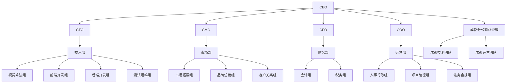

# 四川西吾智创科技有限公司组织架构

## 一、公司组织架构图

## 二、核心管理团队职责

### 1. CEO（首席执行官）
- **直接上级**：董事会
- **直接下级**：CTO、CMO、CFO、COO、成都分公司总经理
- **主要职责**：
  - 制定公司发展战略和经营方针
  - 负责公司整体运营管理
  - 主导重大决策和资源配置
  - 负责对外合作与融资
  - 建设和管理核心团队
  - 统筹总部与分公司的协同发展

### 2. CTO（首席技术官）
- **直接上级**：CEO
- **直接下级**：技术部各组负责人
- **主要职责**：
  - 制定公司技术发展战略
  - 负责技术团队建设和管理
  - 把控产品技术架构和质量
  - 推动技术创新和研发工作
  - 管理技术资源和预算
  - 协调总部与成都分公司技术团队工作

### 3. CMO（首席市场官）
- **直接上级**：CEO
- **直接下级**：市场部各组负责人
- **主要职责**：
  - 制定市场战略和品牌推广计划
  - 负责市场拓展和客户开发
  - 管理市场营销活动和预算
  - 建立和维护客户关系
  - 提升公司品牌知名度和影响力

### 4. CFO（首席财务官）
- **直接上级**：CEO
- **直接下级**：财务部各组负责人
- **主要职责**：
  - 制定公司财务战略和管理制度
  - 负责财务规划和资金管理
  - 监控财务状况和风险控制
  - 负责融资和投资者关系管理
  - 提供财务分析和决策支持

### 5. COO（首席运营官）
- **直接上级**：CEO
- **直接下级**：运营部各组负责人、成都分公司总经理
- **主要职责**：
  - 制定公司运营管理流程和制度
  - 负责日常运营和流程优化
  - 管理人力资源和行政事务
  - 负责项目管理和执行监督
  - 确保公司合规经营
  - 统筹总部与分公司的运营管理

### 6. 成都分公司总经理
- **直接上级**：CEO
- **直接下级**：成都技术团队负责人、成都运营团队负责人
- **主要职责**：
  - 负责成都分公司的日常运营管理
  - 管理成都团队的人员和资源配置
  - 协调与总部各部门的沟通协作
  - 确保分公司业务目标的达成
  - 维护成都地区的客户关系
  - 负责分公司的财务和行政管理

## 三、各部门组织架构及职责

### 1. 技术部
**部门负责人**：技术总监/CTO（兼任）

#### 1.1 视觉算法组
- **组长**：视觉算法主管
- **团队规模**：5-8人
- **主要职责**：
  - 计算机视觉算法研发
  - AI模型训练和优化
  - 图像处理技术应用
  - 硬件选型和嵌入式开发

#### 1.2 前端开发组
- **组长**：前端技术主管
- **团队规模**：3-5人
- **主要职责**：
  - 前端系统架构设计
  - 用户界面开发和优化
  - 移动端应用开发
  - 前端性能优化

#### 1.3 后端开发组
- **组长**：后端技术主管
- **团队规模**：5-8人
- **主要职责**：
  - 后端系统架构设计
  - 数据库设计和优化
  - API接口开发和维护
  - 系统安全和稳定性保障

#### 1.4 测试运维组
- **组长**：测试运维主管
- **团队规模**：2-3人
- **主要职责**：
  - 软件测试和质量保障
  - 系统部署和运维管理
  - 性能监控和故障处理
  - DevOps流程建设和优化

### 2. 市场部
**部门负责人**：市场总监

#### 2.1 市场拓展组
- **组长**：市场拓展主管
- **团队规模**：3-5人
- **主要职责**：
  - 行业市场调研和分析
  - 潜在客户开发和跟进
  - 商务合作洽谈
  - 销售渠道建设

#### 2.2 品牌营销组
- **组长**：品牌营销主管
- **团队规模**：2-3人
- **主要职责**：
  - 品牌推广和宣传
  - 内容营销和社交媒体运营
  - 市场活动策划和执行
  - 媒体关系维护

#### 2.3 客户关系组
- **组长**：客户关系主管
- **团队规模**：2-4人
- **主要职责**：
  - 客户服务和支持
  - 客户满意度调研
  - 客户续约和增值服务
  - 客户反馈收集和分析

### 3. 财务部
**部门负责人**：财务总监/CFO（兼任）

#### 3.1 会计组
- **组长**：会计主管
- **团队规模**：1-2人
- **主要职责**：
  - 日常会计核算和账务处理
  - 财务报表编制和分析
  - 税务申报和缴纳
  - 费用审核和报销管理

#### 3.2 税务组
- **组长**：税务主管
- **团队规模**：1人（可兼任）
- **主要职责**：
  - 税务筹划和合规管理
  - 各类税种申报和缴纳
  - 税务风险识别和防控
  - 税务政策研究和应用

### 4. 运营部
**部门负责人**：运营总监/COO（兼任）

#### 4.1 人事行政组
- **组长**：人事行政主管
- **团队规模**：1-2人
- **主要职责**：
  - 招聘和人才发展
  - 员工关系和企业文化建设
  - 薪酬福利和绩效管理
  - 总部行政事务和办公环境管理
  - 为总部异地员工提供食宿便利

#### 4.2 项目管理组
- **组长**：项目经理
- **团队规模**：2-3人
- **主要职责**：
  - 项目计划制定和执行
  - 项目进度和质量监控
  - 跨部门协调和沟通
  - 项目风险识别和管控

#### 4.3 法务合规组
- **组长**：法务主管
- **团队规模**：1人（可兼任或外包）
- **主要职责**：
  - 合同审查和管理
  - 法律咨询和风险防控
  - 知识产权保护
  - 合规管理体系建设

## 四、人员配置规划

### 初期阶段（1-6个月）
- **总人数**：15-25人
- **核心团队**：CEO、CTO、CMO、CFO、COO
- **技术团队**：10-15人
- **市场团队**：3-5人
- **职能团队**：2-5人

### 发展阶段（6-12个月）
- **总人数**：30-50人
- **核心团队**：CEO、CTO、CMO、CFO、COO
- **技术团队**：20-25人
- **市场团队**：8-12人
- **职能团队**：5-10人

### 成熟阶段（12个月以上）
- **总人数**：50-100人
- **核心团队**：CEO、CTO、CMO、CFO、COO
- **技术团队**：30-45人
- **市场团队**：15-25人
- **职能团队**：10-20人

## 五、组织发展建议

### 1. 短期目标（3个月内）
- 完成核心管理团队搭建
- 建立基本管理制度和流程
- 明确各部门职责和汇报关系
- 启动关键岗位招聘工作

### 2. 中期目标（6个月内）
- 完善组织架构，设立各职能部门
- 建立绩效考核和激励机制
- 形成有效的跨部门协作机制
- 建立人才培养和发展体系

### 3. 长期目标（12个月以上）
- 建立成熟的管理体系和企业文化
- 形成高效的组织运作机制
- 培养内部管理人才梯队
- 实现组织能力持续提升